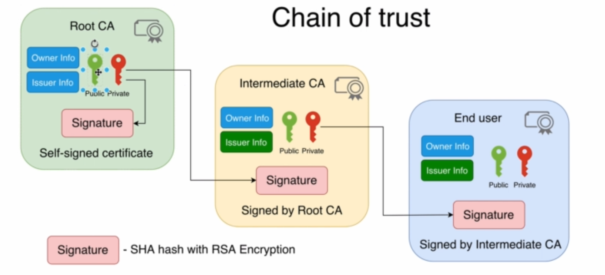

# HTTPS

HTTP is not encrypted and HTTPS is encrypted or HTTPS is secure and HTTP is insecure. Is that all about HTTPS and HTTP ? Definitely NO. There are much more than this. 

To be secure, a site has to be well configured, which means that it must have the A grade. In addition, it must not be vulnerable to any of the two currently known attacks against SSL (`Insecure Renegotiation` and `the BEAST attack`).

Certificates have fingerprints to perform intigrity check.

In network tab of inspect elements in any browser, the domain, scheme, protocol etc can be viewed. It will be helpful to confirm if the site's all the request are encrypted or not. In addition to that always we can get to know whether a site is communicating securely or not by looking at the symbol beside to the URL on browser. Basically it shows 3 symbols, those are Green pad lock, Grey error in circle and Red error bang. 

## Some useful articles related to HTTPS

[Encrypted traffic across Google](https://transparencyreport.google.com/https/overview?hl=en)

[Qualys - SSL Pulse](https://www.ssllabs.com/ssl-pulse/)

[More on HTTPS](https://ahrefs.com/blog/what-is-https/)

## Reading requests and responses looking at Wireshark capture

Wireshark is network packet capturing or sniffing tool. It can read all the traffic going and coming to NIC (Network interface card) of our computer/Server. Basically we can read all the traffic whether it is HTTP, HTTPS, FTP or anything. 

If we will capture all the traffic when browsing something on internet, we can see all the http and https traffic. All http traffic will be readable but all https traffic will be encrypted, so won't be readable.

For HTTP we will see Hyper text transfer protocol on the packets, but in HTTPS we will see http over tls on the packets. The encrypted data only can be decrypted, if we have the key to decrypt it.

## Symmetric and Asymmetric key Encryption

`Symmetric Encryption`: The data is encrypted and decrypted using symmetric key. Various algorithms are there for Encryption, such as:

* DES(Data Encryption standard) - Obsolete
* 3DES(3 Data Encryption standard) - Obsolete
* AES(Advanced Encryption System) - Modern

AES128 and AES256 are used for Symmetric Encryption.

`Asymmetric Key Encryption`: The data is encrypted is using one key and decrypted using another key. 

RSA (Rivest Shamir Adelman) is an algorithm used for Asymmetric key encryption. It is also known as public key crypto system. RSA comes with various key lengths such as 1024, 2048, 3072 & 4096. 

There are two keys in this encryption
* Private key
* Public Key
  
Private key is accessible by the owner only and the public key is accessible for any one. Private key is used to decrypt the data and public key is used to encrypt the data in Asymmetric key encryption.

First, public key is shared with the sender, who wants to send the data. Sender encrypts the data using the public key. Then shares the encrypted data with the receiver. Receiver decrypts the data using the private key. Here the private key is only accessible to the receiver and the Data can only be decrypted using the private key. So this we make sure the data was not accessed by any 3rd person. 

## Hash Functions

When we send data from one place to another place, there are chances that, it will get tampered. To maintain the intigrity of the data we take help of Hashing. 

When we pass some data using hashing algorithm, we get a hash value. But it doesn't work other way around. The data can't be retrived from the Hash value. The size of the hash depends on the hashing algorithm and it remains constant irrespective of the data length. It may 128, 256 or more than that. If we change a single character in the data, the hash will change completely. There are hashing algorithms, which use keys as well.

When we use key for hashing, the sender generates the hash using the key and Data. After the data, key and hash are shared with the reciever. Reciever performs same hashing using the recieved data and key. Then both the generated and recived has are compared. By this we can perform the intigrity test and also can make sure that we have recieved the data from the correct author because of key. 

There are various types of Hashing algorithms, below are the famous ones.

1. MD5 (128 bit)
2. SHA
   * SHA-1 (160 bit)
   * SHA-256 (256 bit)
   * SHA-512 (512 bit)
3. HMAC (This can be used with MD5 and SHA to perform hashing using key.)


Now we will perform some md5 and sha hashing in bash. 

```bash
samleet@DESKTOP:~$ touch test.txt

samleet@DESKTOP:~$ ls
test.txt

samleet@DESKTOP:~$ md5sum test.txt
d41d8cd98f00b204e9800998ecf8427e  test.txt

samleet@DESKTOP:~$ cat > test.txt
Hello

samleet@DESKTOP:~$ md5sum test.txt
09f7e02f1290be211da707a266f153b3  test.txt

samleet@DESKTOP:~$ sha1sum test.txt
1d229271928d3f9e2bb0375bd6ce5db6c6d348d9  test.txt

samleet@DESKTOP:~$ sha256sum test.txt
66a045b452102c59d840ec097d59d9467e13a3f34f6494e539ffd32c1bb35f18  test.txt
```
### Signature verification using Hashing and Asymmetric key

There is one more use of Asymmetric key. This is used for signature verification so that we can make sure that we have recieved the data from the correct author only. Private key is used to generate the signature and public key is used to verify the signature. 

For Signature, first the data is passed through hasing and hash is generated. Then hash is encrypted using private key. Then the data and the encrypted hash shared with reciever. Reciever generates the hash of the data and decrypts the encrypted hash and compare both the hashes to confirm that the data is recieved from thr geninue author.

This concept is used in the ssl certificate verification. Client recieve the signature and verify using the public key recived from the server.


## PKI - Public Key Infrastructure

PKI stands for Public Key Infrastructure. Using PKI we can perform Asymmetric key Encryption. It includes different algorithms, entities etc. We perform the encryption based on certificates and trust. We can perform authentication of the server we are communicating with and so on.

One of the entity of PKI is CA - Certificate authority. It signs the certificates or delegates the trust to the intermediate CA, who signs the server certificates. Certificates can be used for various purposes, such SSL encryption for websites and to bulid VPNs - Virtual Private Network. The certificate contains various data, The main component contained by certificate is public key of the certificate.

### Certificate

The information contained by certificate are
* Information owner: This contains information about the owner of the certificate. For example, if we are getting a certificate from google, then certificate will have information about google. It contains Serial number of the certificate as well.
* Information about issuer: This contains information about the Issuer or CA. The issuer signs the certificate so we can trust on it.
* Public Key: We use this as part of the asymmetric key encryption.
* Signature: We use the signature to verify the certificate using [the Asymmetric key and hashing]( Signature-verification-using-Hashing-and-Asymmetric-key). 
* Certificate validity

Generally the certificates comes with a chain  (Root-Intermediate-End user certificate). When we access https website, we get a certificate and that certificate contains the chain of certificates. The End certificate contains the public key, which is used by browser to encrypt the data transferred to the server of the website.

This end user certificate is trusted by the broswer, because it is signed by the Intermediate CA(Certificate authority) using [the Asymmetric key and hashing]( Signature-verification-using-Hashing-and-Asymmetric-key). The intermediate CA signs the certificate with the help of it's own private key. The certficate comes with the signature signed by Intermediate CA. So when browser recievs the certificate, it verifies the certificate with the help of public key provided in the intermediate certificate.

So the process goes this way, First the public key of the end user cr tificate is hashed using the algorithm mentioned in the certificate. the hash  gets encrypted using the intermediate CA's private key and generates a signature. The certifcates comes with the signature and the public key. When browser recieves the certificate, it first generates the hash using algorithm mentioned in the certificate. Then using the public key contained in the Intermediate CA certificate, it decrypts the signature which gives the hash. Now browser compares both the hashes and confirms that the certificate is signed by the mentioned intermediate CA. Because if the intermediate CA wouldn't have signed the certificate, then we won't be able to decrypt using the public key certificate provided by it.

Now our browser trusted the end user server certificate, but how it will trust the Intermedite CA certificate. The same process goes for it as well. The intermediate CA certificate is signed by root CA and same way browser verifies the signature.

Again, how the browser will trust root CA certificate ? The root CA certificate is a self signed certificate and it is trusted by the browser beacuse it comes with the OS. When we recieve the certificate, first browser looks, if the root CA certificate is there in the OS certificate database. The certifiacte signature can be verified using its own public key as this is a self signed certificate. We can check the windows certificate database `Win+r` -> `certmgr.msc`.



>[Geocertssl](https://www.geocerts.com/ssl-checker), [sslshopper](https://www.sslshopper.com) and [ssllabs](https://www.ssllabs.com) are few of the online certificate verifying tools.

There are 3 types of certificate domain scopes.
1. Single domain (e.g: www.instagram.com)
2. Wildcard (e.g: *.instagram.com)
3. Multi-domain (e.g: facebook.com, fb.com, messenger.com)

There is one more thing, we should know that, RSA is not getting used in the HTTPS for data encryption. Why ? There are 2 main reasons due to which RSA keys are not used.

1. RSA Encryption is slow.
2. Bi-directional data encryption requires RSA key pairs on both sides. Basically the communication between Server and client are bidirectional. So for that we will need both client and server to have their own set of public and private keys and every clients doesn't have their certificates, which can be trusted. 

So the data encryption happens using symmetric key.

### Certificate Signing Request (CSR)

To get our certificate signed by a Certificate authority. we have to generate a CSR. To generate the CSR we need to have the private and public key pair. Then we will send the CSR to the certificate authority. Basically CSR contains the below details.
1. Subject Name
   * Country
   * State
   * Organization
   * Organizational unit
   * Common name
  
2. Public Key

After that CA will take the CSR and will generate the certificate containing above details.

Let's read more about [SSL and TLS](./SSL_TLS.md) protocols which are used in these certificates.


