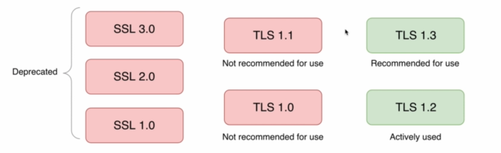
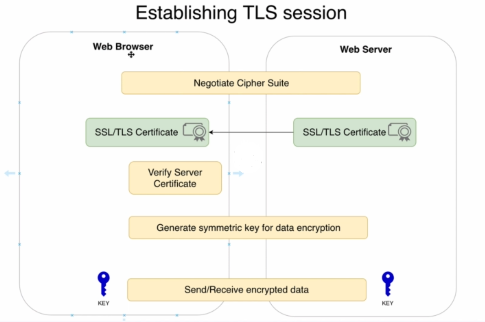
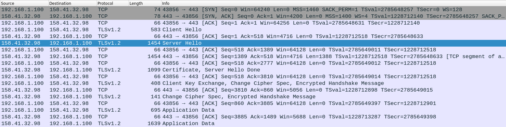
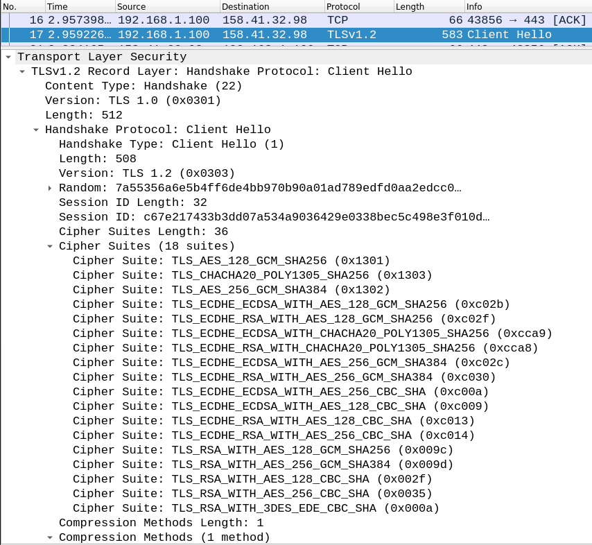
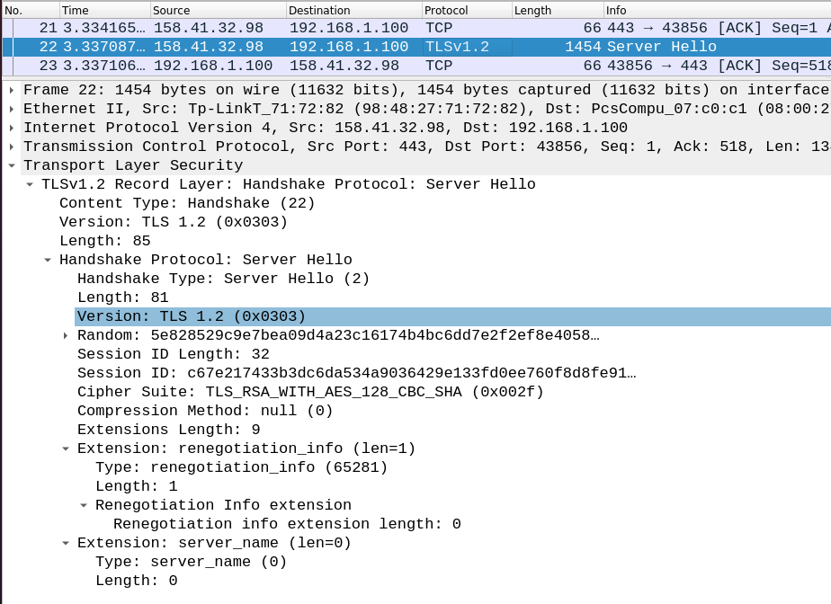
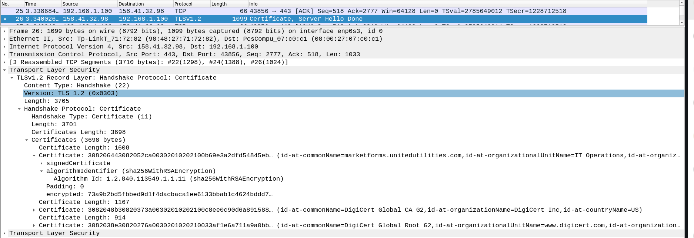
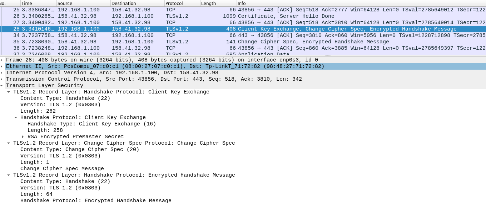
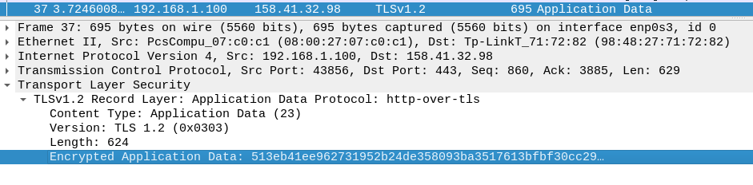

# SSL TLS

SSL and TLS are the protocols used for encryption in PKI. The certificates use these protocols. So these certificates are known with names such as SSL certificate, SSL/TLS certificate and TLS certificate. 

But these certificates should not be called with the name SSL anymore. why ? We will get to know that from the history of these protocols.

## History
------------
Protocol | Published | Status
---------|-----------|-------
SSL 1.0 | Unpublished| Unpublished
SSL 2.0 |1995|Deprecated in 2011|
SSL 3.0 |1996|Deprecated in 2015|
TLS 1.0 |1999|Deprecated in 2020|
TLS 1.1 |2006|Deprecated in 2020
TLS 1.2 |2008|
TLS 1.3 |2018|

From above details we can see that, All SSL protocols are deprecated. So we should not call these certificates as SSL certificates anymore.

## Establishing TLS session

TLS session are established in few steps.

1. In first step, Cipher suite negotiation happens between the web browser and the server. A cipher suite is a set of algorithms that help secure a network connection that uses Transport Layer Security (TLS) or Secure Socket Layer (SSL). The set of algorithms that cipher suites usually contain include: a key exchange algorithm, a bulk encryption algorithm, and a message authentication code (MAC) algorithm.
2. Then the web server send the certificate to the web browser and browser verifies the certificate.
3. After that a symmetric key gets generated by both server and client using Diffie Hellman algorithm.
4. Then using this DH algorithm generated key, data gets encrypted and communicated between the server and client.

### Viewing TLS communication in WireShark

When we try to access any of the HTTPS sites and capture the traffic using wireshark, We get the below traffic capture.

It starts with 3 way handshake as it is a TCP communication. After that Client send the `Client hello` request to server. It contains the cipher suites, which it supports.

To `client Hello` server replies with a `Server Hello`. In that it says, in this communication which cipher suite is going to be used.

After that, Server sends the certificate chain with all details. It contains the validity of the certificate and all other details. Once the certificate is recieved, the client verifies the certificate. The server sends only Intermediate and server certificate but not root certificate. The root certificate is present in the client machine for verification as a trusted certificate.

      

After that Client sends the cipher suite specs which contains the algorithm and encrypted handshake message.

Now onwards encrypted communication happens between the server and client mentioned as `application data`.

Now two below questions arise: 
1. How was the key for data encryption was generated ?
2. How it is securely transferred between client and server ?

Will answer these questions below.

A random key can be generated and can be shared using RSA algorithm. The client generates a key for data encryption and gets encrypted using public key provided in the certificate and server will decrypt that using it's own private key.

But this is not reliable because the private key and public key remains same until it is renewed. So to come over of this problem, we are using [Diffie Hellman key exchange](https://www.comparitech.com/blog/information-security/diffie-hellman-key-exchange/) algorithm for generating the key.

By using this algorithm the key is generated on server and client side but not shared in between them. So it is considered to be more secure.

Let's get started with some [Practical](Practical.md)

