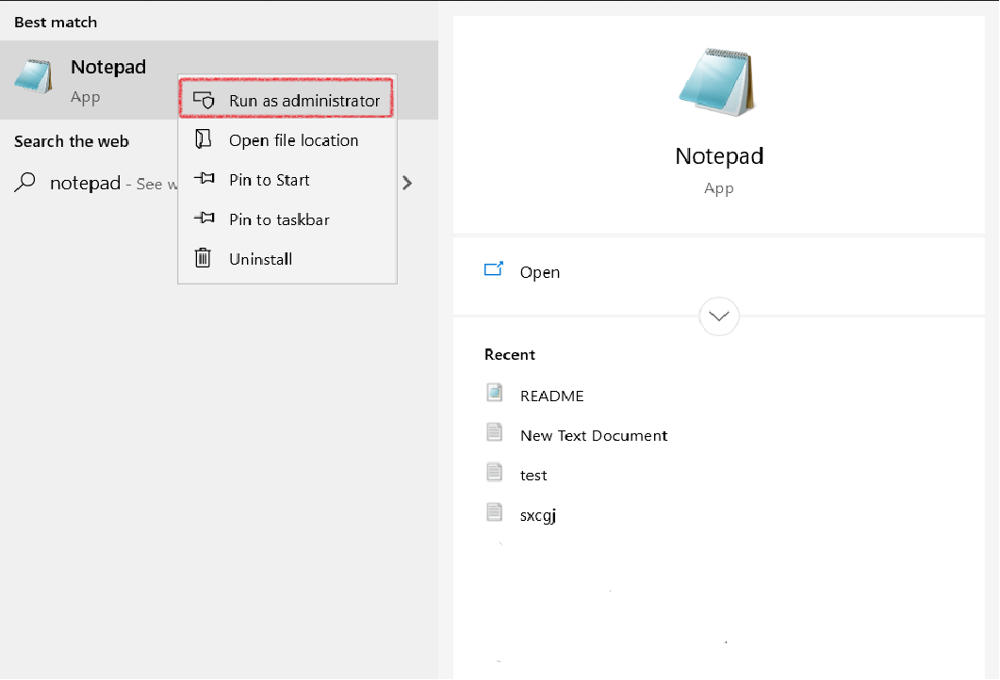

# Editing Host file in Windows and Ubuntu

If for some IP address there is no DNS and we want to give some DNS entry for our local machine, that can be achieved by editing the host file.

## Windows

Step 1: Open notepad in Administrator permission. To do so go to Windows search and search for notepad. Right click on Windows and click on Run as administrator.



Step 2: After that in files click open and go to the following directory c:\Windows\System32\Drivers\etc\hosts. If the file is not visible make file type as `all files`.

Step 3: Open the file and add the IP address and the Server name in below format.

```
asantoshka.online 192.168.1.107
```

Step 4: Save it. Now you can test, if it is working by pinging to the Server name, which is configured on the host file.


## Linux

Step 1: Run the below command

```
sudo nano /etc/hosts
```

Output:

```
127.0.0.1       localhost
127.0.1.1       samTerminal

# The following lines are desirable for IPv6 capable hosts
::1     ip6-localhost ip6-loopback
fe00::0 ip6-localnet
ff00::0 ip6-mcastprefix
```

Step 2: Add the server name and IP address in below format. Then press `Ctrl+o` -> `Enter` -> `Ctrl+x` to save the configs.

```
192.168.1.107   asantoshka.online
```
It should look like below.
```
127.0.0.1       localhost
127.0.1.1       samTerminal
192.168.1.107   asantoshka.online

# The following lines are desirable for IPv6 capable hosts
::1     ip6-localhost ip6-loopback
fe00::0 ip6-localnet
```


